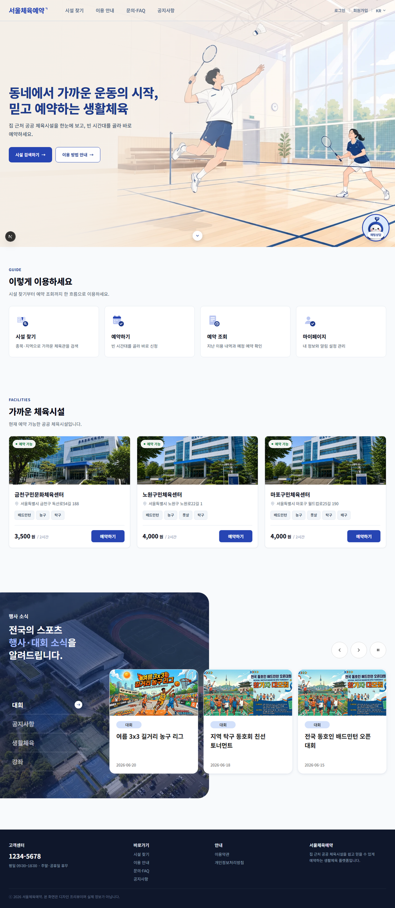
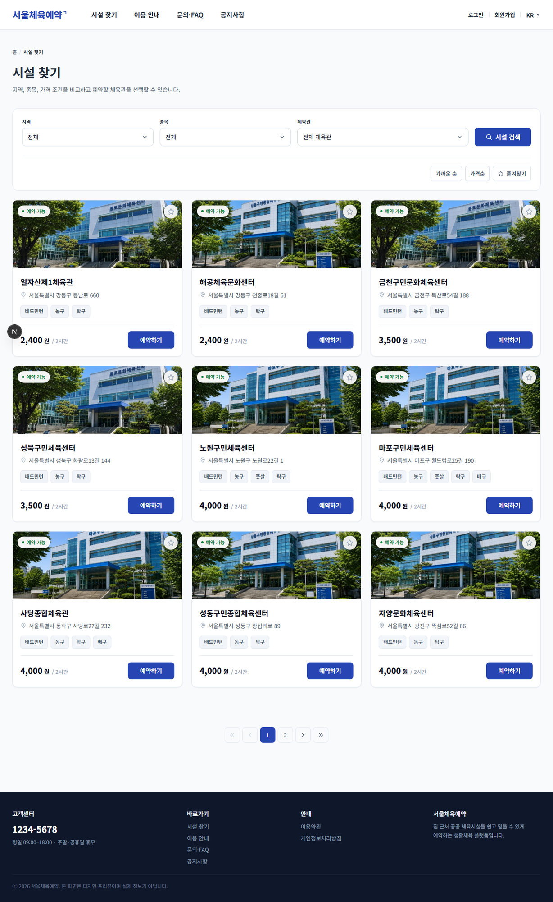

# 서울체육예약 (gym-reservation-web)

집 근처 공공 체육시설을 검색하고 예약하는 웹 서비스. **예약 기능에 더해 운영자용 관리 콘솔과 AI 기반 운영 자동화까지** 직접 설계·구현했습니다.

[](https://github.com/nakyung123/gym-reservation-web/actions/workflows/ci.yml)


**배포** → https://gym-reservation-web-95bi.vercel.app

> 대학 캡스톤에서 기획했던 공공체육관 예약 앱 아이디어를 웹으로 다시 구현한 개인 프로젝트입니다.
> 시설 정보는 서울 공공체육시설을 참고한 샘플 데이터이며, 생성된 예약은 실제 시설에 접수되지 않습니다.

---

## 스크린샷

| 홈 | 시설 찾기 |
|---|---|
|  |  |

<!--
추가 예정 스크린샷 (촬영 후 아래 주석을 해제하고 표에 삽입)
  docs/images/03-reserve.png        예약 생성 흐름 (시간대 선택 화면)
  docs/images/04-admin-revenue.png  관리자 정산 대시보드 (recharts)
  docs/images/05-qr-ticket.png      QR 모바일 입장권
  docs/images/06-faq-chat.png       FAQ 안내봇 대화 (내 예약 조회)
-->

---

## 이 프로젝트에서 다룬 것

### AI · 운영 자동화

- **FAQ 안내봇** — Claude API 기반 스트리밍 챗봇. 큐레이션된 FAQ 위에서 답하고, 로그인 사용자에게는 **내 예약 조회 도구**를 호출해 답변합니다. 도구는 uid를 파라미터로 받지 않아 모델이 남의 예약을 조회할 수 없습니다.
- **일일 AI 운영 브리핑** — Vercel Cron이 전날 지표를 집계하고, Claude가 자연어 요약·이상치·탈퇴 사유 테마를 구조화 출력으로 붙여 Slack에 보냅니다. PII 스크럽과 프롬프트 인젝션 경계를 두고, API 실패 시 숫자 리포트로 폴백합니다.
- **Slack 즉시 알림** — 예약 생성·취소를 실시간 통지.
- **Google Sheets 정산 원장** — 정산 데이터를 스프레드시트로 동기화.

### 사용자 기능

- 체육관 검색·필터(지역·종목·가격), 상세 정보, 즐겨찾기
- 예약 생성·조회·취소, **QR 모바일 입장권**
- Firebase Auth 통합 로그인(이메일·Google·카카오·네이버), 이메일 인증, 비밀번호 재설정
- 1:1 문의, 공지사항 게시판, 이용 안내
- **한국어·영어 다국어**(next-intl, 쿠키 기반이라 URL 유지)

### 관리자 콘솔

예약·슬롯·시설 관리, **정산 대시보드**(recharts), 고객 관리 + 메모, 문의 관리, 배너 관리, **감사 로그**, **접속 기록**

### 품질·성능

- **테스트 파일 120개** — API 라우트 단위 테스트 + 도메인 규칙 테스트
- **k6 부하 테스트** — 정원 10팀 슬롯에 200명 동시 요청을 걸어 정합성 검증, 인덱스 성능 측정 ([load-test/](load-test/))
- DB 인덱스 추가로 관리자·정산 조회 풀스캔 제거(예약 12만건 기준 DB 계층 9.5~310배), 예약 목록 서버 페이지네이션

---

## 기술적 이슈 & 해결

각 항목의 전체 내용(원인 분석 과정, 코드, 커밋)은 **[docs/troubleshooting.md](docs/troubleshooting.md)** 에 있습니다.

| 이슈 | 요약 |
|---|---|
| **슬롯 정원 동시성** | 조회 후 생성 사이의 TOCTOU로 정원 초과 가능. 카운터 증가 조건을 `UPDATE` 문 자체에 넣고(`reserved_count < capacity`) 갱신 행 수로 판단. k6로 200명 동시 요청을 걸어 **DB 불변식 4가지**로 검증 |
| **중복 예약 방지** | 애플리케이션 검사는 동시 요청에 뚫림. `activeKey` UNIQUE 제약으로 DB가 최종 방어선 |
| **챗봇 세션 격리** | 로그아웃 후에도 이전 사용자 예약이 답변됨. 서버 uid 스코프는 정상이었고 원인은 **클라이언트 대화 이력**. 확정된 로그인 주체 변경 시 이력 초기화 + 회귀 테스트 2건 |
| **예약 폼 18N 비교** | 시간대 18개마다 전체 예약을 훑어 2,000건 사용자면 36,000회 비교. 후보를 미리 좁혀 `N + 18×소수`로. **동치성 테스트**로 결과 불변 보장 |
| **인덱스 최적화와 측정** | 관리자 쿼리가 풀스캔. 인덱스 3개 추가 후 예약 12만건 기준 **DB 계층은 9.5~310배** 개선. 그런데 **HTTP는 10%만** 빨라짐 — 응답시간 대부분이 Firebase revoked 토큰 검사 왕복이었음. 계층을 분리해 재지 않았으면 오판할 뻔한 사례 |
| **AI 브리핑 PII·인젝션** | 탈퇴 사유 자유텍스트가 제3자 API로 나감. 전송 전 스크럽 + 출력 제약 + 데이터/지시 경계 명시 |
| **LLM 비용 상한** | 공개 데모라 인증이 없음. rate limit 3단(IP 분당 5 / IP 일 8 / **전역 일 20**) + fail-closed + 콘솔 지출 한도 |

---

## 기술 스택

| 영역 | 기술 |
|---|---|
| Framework | Next.js 16 (App Router) |
| UI | React 19, Tailwind CSS 4, recharts, qrcode.react |
| Language | TypeScript |
| Database | Postgres (운영: Supabase / 로컬: Docker) |
| ORM | Prisma 6 |
| Auth | Firebase Auth (+ App Check), Firebase Admin |
| Validation | Zod |
| i18n | next-intl |
| AI | Anthropic Claude API (`@anthropic-ai/sdk`) |
| 외부 연동 | Slack Webhook, Google Sheets API, Supabase Storage |
| Test | Vitest, Testing Library, k6 |
| CI/배포 | GitHub Actions, Vercel |

---

## 실행 방법

```bash
npm install
docker compose up -d          # 로컬 Postgres
cp .env.example .env.local    # 값 채우기 (항목 설명은 .env.example 주석 참고)
npm run db:migrate:deploy
npm run db:seed
npm run dev                   # http://localhost:3000
```

환경 변수는 [`.env.example`](.env.example)에 항목별 설명이 있습니다. 실제 값은 저장소에 커밋하지 않습니다.

### 관리자 화면

`/admin`으로 진입합니다. 접근에는 두 가지가 모두 필요합니다.

1. `/admin` 페이지의 **Basic Auth** (`ADMIN_PAGE_USER` / `ADMIN_PAGE_PASSWORD`) — 1차 잠금
2. `/api/admin/*`의 **Firebase custom claim `admin: true`** — 실제 권한

claim은 운영자가 Firebase Admin SDK로 사전에 부여합니다. 저장소에는 범용 claim 부여 스크립트를 포함하지 않습니다.

---

## 테스트

```bash
npx tsc --noEmit --pretty false
npm run lint
npm run test:unit    # DB 없이 도는 서브셋
npm run test         # 전체 (테스트 DB 필요)
```

테스트 DB는 `.env.test.local`의 `DATABASE_URL`을 쓰며, URL에 `gym_reservation_test`가 포함되지 않으면 **즉시 실패**하도록 막아 뒀습니다(운영 DB 오작동 방지).

부하 테스트 실행 방법은 [`load-test/README.md`](load-test/README.md)에 있습니다.

---

## 문서

| 문서 | 내용 |
|---|---|
| [아키텍처](docs/architecture.md) | 계층 구성, 인증·권한, rate limit, 보안 경계, 자동화 파이프라인 |
| [트러블슈팅](docs/troubleshooting.md) | 실제로 부딪힌 문제 7건의 원인 분석과 해결 |
| [운영 런북](docs/ops-runbook.md) | 배포·장애 대응 절차 |
| [데이터 모델](docs/data-model.md) | 테이블·관계 정의 |
| [결제 설계](docs/payment-design.md) | 결제 도입 시 서버 기준 금액 검증 설계 |
| [제품 개요](docs/product-brief.md) | 기획 배경과 범위 |
| [부하 테스트](load-test/README.md) | k6 하네스 사용법 |

---

## 향후 계획

- 결제 연동 (설계는 [payment-design.md](docs/payment-design.md)에 정리)
- 예약 알림 (FCM 또는 이메일)
- 공휴일 데이터 기반 휴관일 자동 계산
- 여러 날짜 선택 기반 슬롯 일괄 관리
